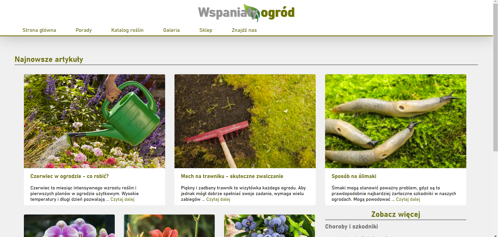

# Wspanialy ogrod
Project to pass the subject "Basics of web applications".
HTML, CSS, JavaScript, positioning, responsiveness, SPA, form validation, jQuery, Bootstrap, localStorage, sessionStorage, geolocation.

## Table of Contents
* [General Info](#general-information)
* [Technologies Used](#technologies-used)
* [Screenshots](#screenshots)
* [Usage](#usage)
* [Project Status](#project-status)
* [Room for Improvement](#room-for-improvement)
* [Acknowledgements](#acknowledgements)
* [Contact](#contact)

## General Information
- Getting to know the basic issues of creating an application
websites using current design and programming standards
on the Internet.
- Acquiring the ability to create simple internet applications
using modern technologies and tools:
HTML, CSS, JavaScript, positioning, responsiveness, SPA, form validation, jQuery, Bootstrap, localStorage, sessionStorage, geolocation.

## Technologies Used
- HTML5
- CSS
- Vanilla JavaScript
- Apache NetBeans IDE 12.3
- jQuery 3.6.0
- Bootstrap v5.0.1

## Screenshots

## Usage
Open index.html.

## Project Status
Completed. I will not work on it anymore, because it was passed in this form.

## Room for Improvement
- Improvement of the display on larger displays, the application is not adapted to large monitors.

## Acknowledgements
- This project was inspired by [Zielony ogrodek](https://zielonyogrodek.pl).
- This project was based on [Zintegrowany Program Rozwoju Politechniki Lubelskiej](https://weii.pollub.pl/projekty-weii/projekt-zintegrowany-program-rozwoju-politechniki-lubelskiej-czesc-druga).

## Contact
Created by [@jagoda.krystosiak](jagoda.krystosiak@gmail.com) - feel free to contact me!
